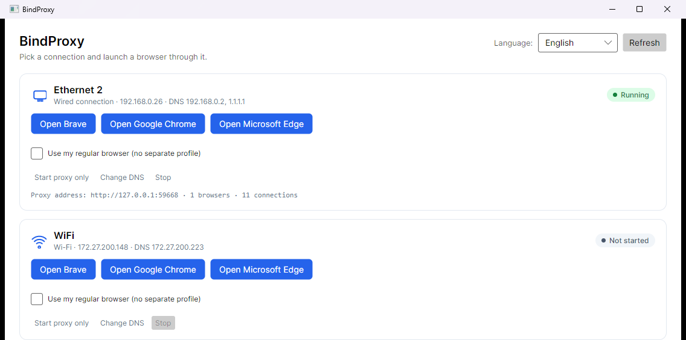

> **⚠️ AI disclaimer:** This project was built almost entirely by AI coding agents (Claude Code and GitHub Copilot CLI), with human review and direction. Treat it accordingly — read the code before you trust it with anything sensitive.

# BindProxy

Pick a network connection, launch a browser through it. Nothing else on your PC changes.



BindProxy spins up a local forward proxy pinned to a specific NIC (with matching DNS), then launches your browser configured to use it — so one browser window/profile can go out over Wi-Fi while everything else keeps using Ethernet, or vice versa.

## Get it

**[⬇ Download for Windows](https://github.com/mfiferna/bindproxy/releases/latest/download/bindproxy-win-x64.zip)** — unzip and run the `.exe`, no install needed.

Prefer the terminal UI, or want an older version? See the [Releases page](https://github.com/mfiferna/bindproxy/releases).

## Build from source

```
git clone https://github.com/mfiferna/bindproxy.git
cd bindproxy
run.bat        # Avalonia desktop UI
run-tui.bat    # terminal UI
```

Requires the [.NET 10 SDK](https://dotnet.microsoft.com/download). See [`release.bat`](release.bat) / [`release.sh`](release.sh) to build compact self-contained release binaries yourself.
